# Mateus Gonçalves
### Dev em formação | Full-Stack Java

Desenvolvedor **Full-Stack Java** em formação, com maior afinidade em **Front-end**, utilizando HTML, CSS, SCSS e JavaScript em projetos práticos e organizados. Possuo **base em Java**, aplicada em projetos e estudos. Atualmente, estou iniciando estudos e pesquisas em **React**.

---

## 🧰 Stack

**Front-end**  

**Back-end**  

**Ferramentas**  

---

## 🚀 Projeto em destaque

 🧟 **Dying Light Frontend (Fan Site)**  
 Site informativo inspirado no jogo **Dying Light**, desenvolvido como projeto prático de front-end, com foco em estrutura semântica, organização de estilos e experiência do usuário.  
  
 **Tecnologias:** HTML, CSS, SCSS e JavaScript  
 
 
 

---

## 📊 Visão geral

---

## 📫 Contato

